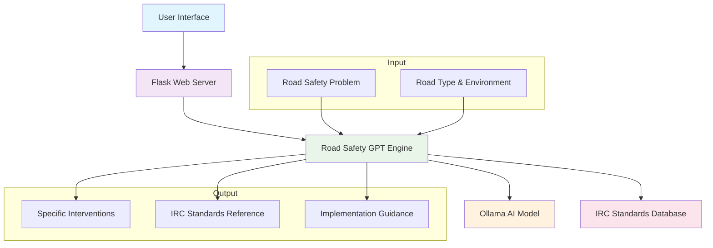

# Road Safety GPT

An AI-powered road safety intervention system that provides expert recommendations based on IRC standards and global best practices. This tool helps identify appropriate road safety interventions for addressing specific road safety issues within given road networks.

## Table of Contents

- [Overview](#overview)
- [Features](#features)
- [System Architecture](#system-architecture)
- [Installation](#installation)
- [Usage](#usage)
- [API Endpoints](#api-endpoints)
- [Technology Stack](#technology-stack)
- [Project Structure](#project-structure)
- [Contributing](#contributing)
- [License](#license)

## Overview

Road Safety GPT is an intelligent assistant that analyzes road safety problems and recommends specific interventions from a curated database of IRC standards and global best practices. The system uses AI to match user-described road safety issues with appropriate technical solutions, complete with standard references and implementation guidelines.

## Features

- **AI-Powered Analysis**: Uses local LLM (Ollama) to understand road safety problems
- **Comprehensive Database**: 50+ pre-loaded interventions based on IRC standards
- **Smart Matching**: Intelligent keyword-based and contextual matching
- **Interactive Chat**: Clean, ChatGPT-like web interface
- **Real-time Recommendations**: Instant intervention suggestions with standards references
- **Conversation History**: Persistent chat history across sessions
- **Responsive Design**: Works on desktop and mobile devices

## System Architecture



## Installation

### Prerequisites

- Python 3.8+
- Ollama
- 4GB RAM minimum

### Step-by-Step Setup

1. **Clone the repository**
   ```bash
   git clone <repository-url>
   cd road_safety_gpt
   ```

2. **Install Python dependencies**
   ```bash
   pip install -r requirements.txt
   ```

3. **Install and setup Ollama**
   ```bash
   # Install Ollama
   curl -fsSL https://ollama.ai/install.sh | sh
   
   # Pull the AI model
   ollama pull phi3:mini
   ```

4. **Process the road safety database**
   ```bash
   python3 data/database_processor.py
   ```

5. **Start the application**
   ```bash
   python3 app.py
   ```

6. **Access the application**
   Open your browser and navigate to `http://localhost:5500`

## Usage

### Basic Usage

1. **Describe the Problem**: Enter a road safety issue in natural language
   - Example: "Missing warning signs on curved roads"
   - Example: "Damaged pedestrian crossings near schools"

2. **Get Recommendations**: Receive specific interventions with:
   - IRC standard references
   - Technical specifications
   - Implementation guidance
   - Keyword matches

3. **Explore History**: Review previous conversations and recommendations

### Example Queries

- "There are damaged STOP signs at intersections"
- "Faded road markings on highways"
- "Need speed control measures in residential areas"
- "Missing pedestrian crossing signs near schools"

## API Endpoints

| Endpoint | Method | Description |
|----------|--------|-------------|
| `/` | GET | Main chat interface |
| `/api/chat` | POST | Send message and get AI response |
| `/api/status` | GET | Check system status |
| `/api/history` | GET | Get chat history |
| `/api/clear` | POST | Clear chat history |
| `/api/debug` | POST | Debug endpoint |

### Example API Usage

```bash
curl -X POST http://localhost:5500/api/chat \
  -H "Content-Type: application/json" \
  -d '{"message": "Missing warning signs on curves"}'
```

## Technology Stack

### Backend
- **Python 3** - Core programming language
- **Flask** - Web framework
- **Ollama** - Local LLM integration
- **Pandas** - Data processing

### Frontend
- **HTML5** - Markup
- **CSS3** - Styling with modern features
- **JavaScript** - Client-side interactivity
- **SVG Icons** - Crisp, scalable graphics

### AI & Data
- **phi3:mini** - Lightweight language model
- **IRC Standards** - Road safety database
- **JSON** - Data interchange format

## Project Structure

```
road_safety_gpt/
├── app.py                 # Main Flask application
├── scripts/
│   ├── app.py            # CLI version
│   └── ollama_client.py  # Ollama integration
├── data/
│   ├── raw_database/     # Original CSV data
│   └── processed_database.json  # Processed interventions
├── prompts/
│   └── system_prompt.txt # AI instructions
├── templates/
│   └── index.html        # Web interface
├── requirements.txt      # Python dependencies
└── README.md            # Project documentation
```

## Configuration

### Environment Variables

The application can be configured using environment variables:

```bash
export OLLAMA_HOST="http://localhost:11434"
export FLASK_PORT=5500
export FLASK_DEBUG=true
```

### Model Configuration

Supported Ollama models:
- `phi3:mini` (Recommended - 2.3GB)
- `llama3.1:8b` (4.7GB)
- `llama3:8b` (4.7GB)

## Contributing

We welcome contributions to improve Road Safety GPT! Here's how you can help:

1. **Report Bugs**: Open an issue with detailed description
2. **Suggest Features**: Share your ideas for new features
3. **Submit Pull Requests**: Implement improvements or new features
4. **Improve Documentation**: Help enhance this README or other docs

### Development Setup

1. Fork the repository
2. Create a feature branch
3. Make your changes
4. Test thoroughly
5. Submit a pull request

## Performance

- **Response Time**: 5-15 seconds per query
- **Database**: 50+ interventions with full specifications
- **Memory Usage**: ~2.5GB (with phi3:mini model)
- **Concurrent Users**: Limited by Ollama instance

## Troubleshooting

### Common Issues

1. **"Database not found"**
   ```bash
   python3 data/database_processor.py
   ```

2. **"Cannot connect to Ollama"**
   ```bash
   ollama serve
   ollama pull phi3:mini
   ```

3. **Memory issues on M2 Mac**
   - Use `phi3:mini` model
   - Close other applications
   - Restart Ollama: `pkill ollama && ollama serve`

### Getting Help

- Check the debug endpoint: `/api/debug`
- View server logs for detailed error information
- Ensure all prerequisites are installed correctly

## License

This project is licensed under the MIT License - see the LICENSE file for details.

## Acknowledgments

- IRC Standards for comprehensive road safety guidelines
- Ollama for providing accessible local AI capabilities
- Flask Community for the excellent web framework
- Contributors who help improve this project

---

<div align="center">

Made for safer roads

*If this project helps make roads safer, please consider giving it a star*

</div>